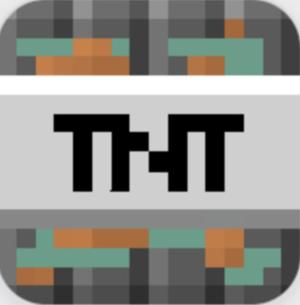

<h1>The TNT Update </h1>

<strong>A Minecraft mod built for 1.21.8 that adds many cool new types of TNT.</strong>

> [!NOTE]
> This mod was built using MCreator for NeoForge. It uses Java 

> [!TIP]
> Check the Modrinth Page for all custom crafting recipes

> [!IMPORTANT]
> This mod is only supported on Java 1.21.8. Using it on other versions does not guarantee stability or functionality.

<h2>New TNT Crafting Recipies</h2>

<!--Copied from Modrinth Website-->
<table>
    <thead>
        <tr>
            <th>Name</th>
            <th>Action</th>
            <th>Main crafting recipe / description of main crafting recipe</th>
            <th>Side block texture / description of side block texture</th>
        </tr>
    </thead>
    <tbody>
        <tr>
            <td>2x TNT</td>
            <td>Makes an explosion with the power of 2</td>
            <td></td>
            <td></td>
        </tr>
        <tr>
            <td>5x TNT</td>
            <td>Makes an explosion with the power of 5</td>
            <td></td>
            <td></td>
        </tr>
        <tr>
            <td>10x TNT</td>
            <td>Makes an explosion with the power of 10</td>
            <td></td>
            <td></td>
        </tr>
        <tr>
            <td>Immediate TNT</td>
            <td>Makes a normal explosion but explodes instantly</td>
            <td></td>
            <td></td>
        </tr>
        <tr>
            <td>Nuclear TNT</td>
            <td>Makes an huge, fiery explosion</td>
            <td></td>
            <td></td>
        </tr>
        <tr>
            <td>Hole TNT</td>
            <td>Makes a big hole in the ground</td>
            <td></td>
            <td></td>
        </tr>
        <tr>
            <td>Diamond Ore TNT</td>
            <td>Makes a 3 by 3 by 3 cube of diamond ore</td>
            <td></td>
            <td></td>
        </tr>
        <tr>
            <td>Deepslate Diamond Ore TNT</td>
            <td>Makes a 3 by 3 by 3 cube of deepslate diamond ore</td>
            <td></td>
            <td></td>
        </tr>
        <tr>
            <td>Emerald Ore TNT</td>
            <td>Makes a 3 by 3 by 3 cube of emerald ore</td>
            <td>One piece of normal TNT in the middle of the crafting table with emerald ore surrounding on all sides</td>
            <td>Emerald ore but with the TNT label on it</td>
        </tr>
        <tr>
            <td>Deepslate Emerald Ore TNT</td>
            <td>Makes a 3 by 3 by 3 cube of deepslate emerald ore</td>
            <td>One piece of normal TNT in the middle of the crafting table with deepslate emerald ore surrounding on all sides</td>
            <td>Deepslate emerald ore but with the TNT label on it</td>
        </tr>
        <tr>
            <td>Redstone Ore TNT</td>
            <td>Makes a 3 by 3 by 3 cube of redstone ore</td>
            <td>One piece of normal TNT in the middle of the crafting table with redstone ore surrounding on all sides</td>
            <td>Redstone ore but with the TNT label on it</td>
        </tr>
        <tr>
            <td>Deepslate Redstone Ore TNT</td>
            <td>Makes a 3 by 3 by 3 cube of deepslate redstone ore</td>
            <td>One piece of normal TNT in the middle of the crafting table with deepslate redstone ore surrounding on all sides</td>
            <td>Deepslate redstone ore but with the TNT label on it</td>
        </tr>
        <tr>
            <td>Gold Ore TNT</td>
            <td>Makes a 3 by 3 by 3 cube of gold ore</td>
            <td>One piece of normal TNT in the middle of the crafting table with gold ore surrounding on all sides</td>
            <td>Gold ore but with the TNT label on it</td>
        </tr>
        <tr>
            <td>Deepslate Gold Ore TNT</td>
            <td>Makes a 3 by 3 by 3 cube of deepslate gold ore</td>
            <td>One piece of normal TNT in the middle of the crafting table with deepslate gold ore surrounding on all sides</td>
            <td>Deepslate gold ore but with the TNT label on it</td>
        </tr>
        <tr>
            <td>Nether Gold Ore TNT</td>
            <td>Makes a 3 by 3 by 3 cube of Nether gold ore</td>
            <td>One piece of normal TNT in the middle of the crafting table with Nether gold ore surrounding on all sides</td>
            <td>Nether gold ore but with the TNT label on it</td>
        </tr>
        <tr>
            <td>Iron Ore TNT</td>
            <td>Makes a 3 by 3 by 3 cube of iron ore</td>
            <td>One piece of normal TNT in the middle of the crafting table with iron ore surrounding on all sides</td>
            <td>Iron ore but with the TNT label on it</td>
        </tr>
        <tr>
            <td>Deepslate Iron Ore TNT</td>
            <td>Makes a 3 by 3 by 3 cube of deepslate iron ore</td>
            <td>One piece of normal TNT in the middle of the crafting table with deepslate iron ore surrounding on all sides</td>
            <td>Deepslate iron ore but with the TNT label on it</td>
        </tr>
        <tr>
            <td>Coal Ore TNT</td>
            <td>Makes a 3 by 3 by 3 cube of coal ore</td>
            <td>One piece of normal TNT in the middle of the crafting table with coal ore surrounding on all sides</td>
            <td>Coal ore but with the TNT label on it</td>
        </tr>
        <tr>
            <td>Deepslate Coal Ore TNT</td>
            <td>Makes a 3 by 3 by 3 cube of deepslate coal ore</td>
            <td>One piece of normal TNT in the middle of the crafting table with deepslate coal ore surrounding on all sides</td>
            <td>Deepslate coal ore but with the TNT label on it</td>
        </tr>
        <tr>
            <td>Copper Ore TNT</td>
            <td>Makes a 3 by 3 by 3 cube of copper ore</td>
            <td>One piece of normal TNT in the middle of the crafting table with copper ore surrounding on all sides</td>
            <td>Copper ore but with the TNT label on it</td>
        </tr>
        <tr>
            <td>Deepslate Copper Ore TNT</td>
            <td>Makes a 3 by 3 by 3 cube of deepslate copper ore</td>
            <td>One piece of normal TNT in the middle of the crafting table with deepslate copper ore surrounding on all sides</td>
            <td>Deepslate copper ore but with the TNT label on it</td>
        </tr>
        <tr>
            <td>Lapis Lazuli Ore TNT</td>
            <td>Makes a 3 by 3 by 3 cube of lapis lazuli ore</td>
            <td>One piece of normal TNT in the middle of the crafting table with lapis lazuli ore surrounding on all sides</td>
            <td>Lapis lazuli ore but with the TNT label on it</td>
        </tr>
        <tr>
            <td>Deepslate Lapis Lazuli Ore TNT</td>
            <td>Makes a 3 by 3 by 3 cube of deepslate lapis lazuli ore</td>
            <td>One piece of normal TNT in the middle of the crafting table with deepslate lapis lazuli ore surrounding on all sides</td>
            <td>Deepslate lapis lazuli ore but with the TNT label on it</td>
        </tr>
        <tr>
            <td>Nether Quartz Ore TNT</td>
            <td>Makes a 3 by 3 by 3 cube of Nether quartz ore</td>
            <td>One piece of normal TNT in the middle of the crafting table with nether quartz ore surrounding on all sides</td>
            <td>Nether quartz ore but with the TNT label on it</td>
        </tr>
        <tr>
            <td>Ancient Debris TNT</td>
            <td>Makes a 3 by 3 by 3 cube of ancient debris</td>
            <td>One piece of normal TNT in the middle of the crafting table with ancient debris surrounding on all sides</td>
            <td>Ancient debris but with the TNT label on it</td>
        </tr>
        <tr>
            <td>World Eater TNT</td>
            <td>Will literally slowly eat your world</td>
            <td></td>
            <td></td>
        </tr>
        <tr>
            <td>Ice TNT</td>
            <td>Turns all blocks in a nearby radius into ice</td>
            <td></td>
            <td></td>
        </tr>
        <tr>
            <td>Nether TNT</td>
            <td>Turns all blocks in a nearby radius into Nether blocks</td>
            <td></td>
            <td></td>
        </tr>
    </tbody>
</table>

<h2>Media</h2>

<h2>Get Mod </h2>

To get The TNT Update Mod on Modrinth, click <a href="https://modrinth.com/project/the-tnt-update">this link.</a>

<h2>Legal and Guidelines</h2>
<ul>
  <li>See the project <a href="LICENSE">license</a></li>
</ul>
